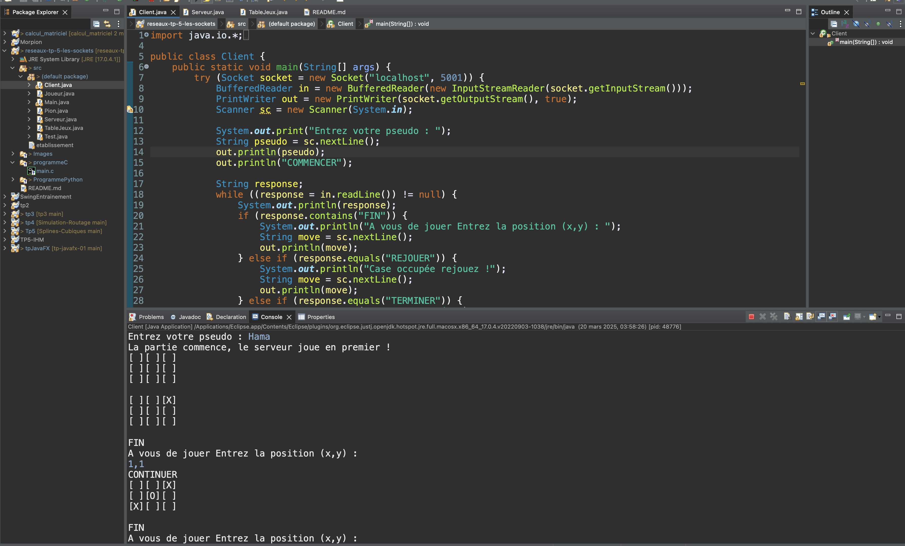
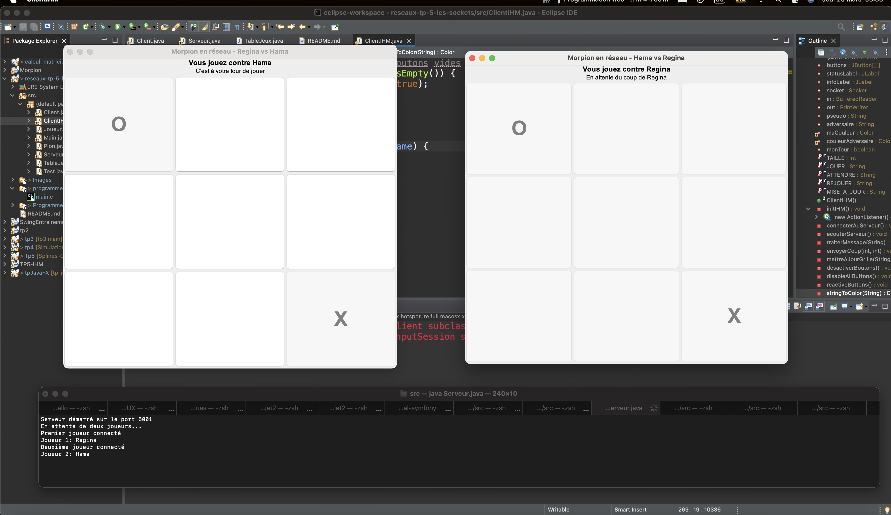
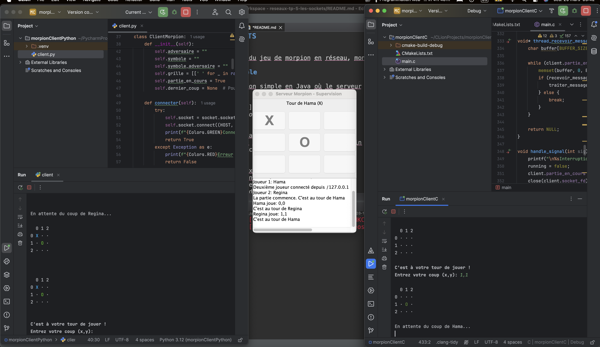
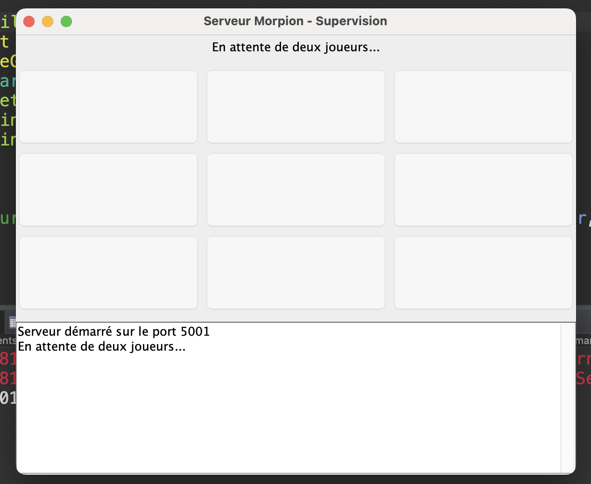
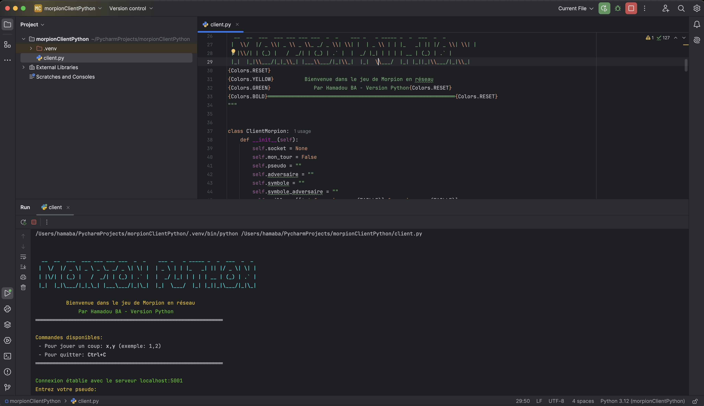
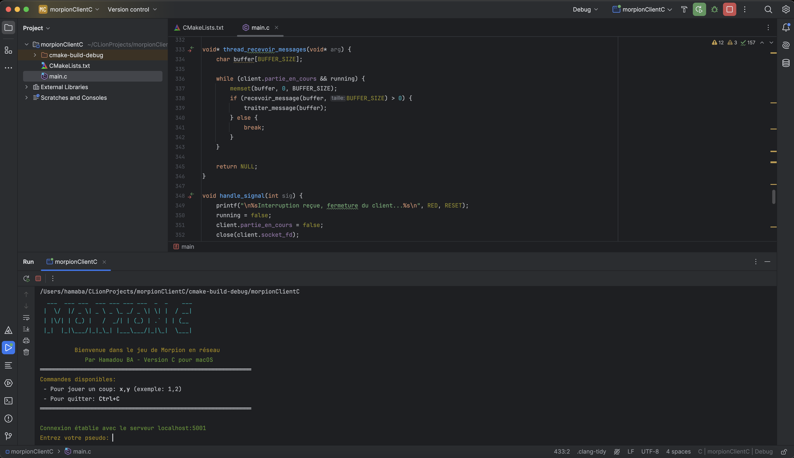

# Jeu de Morpion en Réseau - SOCKETS
**Auteur: Hamadou BA**

Ce document présente les trois versions du jeu de morpion en réseau, montrant l'évolution progressive du projet.

## Version 1: Java Client-Serveur Simple

La première version est une implémentation simple en Java où le serveur joue automatiquement contre un client humain.

### Aperçu

### Caractéristiques
- **Serveur Java**: Génère des coups aléatoires automatiquement
- **Client Java**: Interface en ligne de commande pour le joueur humain
- **Pas d'interface graphique**: Communication uniquement via console

### Architecture
- Un serveur qui accepte une seule connexion client
- Le serveur joue automatiquement avec une stratégie aléatoire
- Le client envoie ses coups via une interface console
- Communication via des sockets TCP standards

### Fonctionnement
1. Le serveur démarre et attend une connexion
2. Le client se connecte et envoie son pseudo
3. Le serveur joue automatiquement le premier coup
4. Le client joue en entrant des coordonnées
5. Les deux parties communiquent l'état du jeu via des messages textuels

### Avantages et Limitations
**Avantages**:
- Simplicité de conception
- Facilité d'implémentation
- Un seul langage (Java)

**Limitations**:
- Expérience utilisateur minimaliste
- Le serveur joue de façon aléatoire (pas d'IA)
- Pas d'interface graphique
- Un seul client à la fois

---

## Version 2: Client Java avec IHM

La deuxième version ajoute des interfaces graphiques aux clients Java et permet à deux joueurs humains de s'affronter.

### Aperçu

### Caractéristiques
- **Serveur Java**: Fonctionne en arrière-plan pour coordonner le jeu
- **Deux clients Java**: Chacun avec une interface graphique Swing
- **IHM complète**: Grille de jeu cliquable et affichage de l'état

### Architecture
- Un serveur qui accepte deux connexions client
- Deux clients avec interfaces graphiques identiques
- Le serveur transmet les coups entre les clients
- Communication via sockets TCP standards

### Fonctionnement
1. Le serveur démarre et attend deux connexions client
2. Les deux clients se connectent et envoient leurs pseudos
3. Les clients alternent les tours en cliquant sur la grille
4. L'interface affiche l'état actuel et le joueur dont c'est le tour
5. Le serveur détecte les conditions de victoire ou de match nul

### Améliorations par rapport à la Version 1
- Interfaces graphiques pour les deux joueurs
- Affichage intuitif de la grille
- Deux joueurs humains
- Indication visuelle du tour actuel
- Feedback immédiat des coups joués

---

## Version 3: Multi-langage avec Serveur IHM

La troisième version est une architecture multi-langage où le serveur possède une interface graphique et les clients sont en ligne de commande, implémentés en différents langages.

### Aperçu

### Aperçu du Programme JAVA Serveur

### Aperçu du Programme PYTHON Client

### Aperçu du Programme C Client

### Caractéristiques
- **Serveur Java avec IHM**: Interface graphique Swing pour superviser les parties
- **Client Python**: Interface ligne de commande avec affichage coloré
- **Client C**: Interface ligne de commande optimisée pour macOS
- **Mise en évidence du dernier coup**: Sur tous les composants (serveur et clients)

### Architecture
- Un serveur central avec interface graphique de supervision
- Clients en différents langages (Java, Python, C)
- Protocole de communication texte standardisé
- Fonctionnalités adaptées à chaque langage

### Fonctionnement
1. Le serveur démarre et affiche une interface graphique de supervision
2. Les clients (en Python ou C) se connectent et envoient leurs pseudos
3. Les clients jouent à tour de rôle via leur interface console
4. Le serveur affiche en temps réel l'état du jeu et le dernier coup joué
5. Tous les composants mettent en évidence le dernier coup pour meilleure lisibilité

### Améliorations par rapport à la Version 2
- Architecture multi-langage
- Interface de supervision sur le serveur
- Clients légers en ligne de commande
- Mise en évidence du dernier coup sur tous les composants
- Meilleure séparation des responsabilités
- Adaptabilité à différents environnements (Python, C, Java)

---

## Comparaison des Versions

| Caractéristique            | Version 1                | Version 2                   | Version 3                       |
|----------------------------|--------------------------|-----------------------------|---------------------------------|
| Langages                   | Java uniquement          | Java uniquement             | Java, Python, C                 |
| Interface Serveur          | Console                  | Console                     | Graphique                       |
| Interface Client           | Console                  | Graphique                   | Console                         |
| Nombre de clients          | 1 client                 | 2 clients                   | 2 clients                       |
| Rôle du serveur            | Joue automatiquement     | Coordonne uniquement        | Coordonne et supervise          |
| Affichage dernier coup     | Non                      | Oui (client uniquement)     | Oui (serveur et clients)        |
| Complexité d'implémentation| Basse                    | Moyenne                     | Haute                           |
| Flexibilité                | Limitée                  | Modérée                     | Élevée                          |

## Conclusion

L'évolution du jeu de morpion en réseau illustre une progression naturelle dans le développement d'applications distribuées:

1. **Version 1**: Implémentation fondamentale du concept client-serveur
2. **Version 2**: Amélioration de l'expérience utilisateur avec des interfaces graphiques
3. **Version 3**: Adoption d'une architecture multi-langage avec séparation claire des responsabilités

Chaque version a ses propres avantages et cas d'utilisation. La Version 1 est idéale pour l'apprentissage des concepts de base, la Version 2 offre une meilleure expérience utilisateur pour les joueurs, tandis que la Version 3 démontre l'interopérabilité entre différents langages de programmation et la supervision centralisée.

---

© 2025 Hamadou BA - Tous droits réservés
